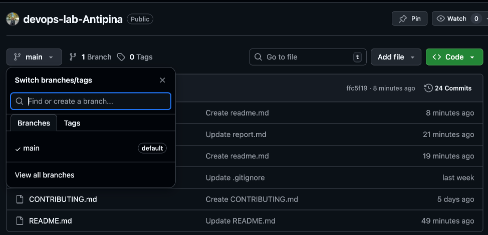

# Отчёт по лабораторной работе № 0

**Университет:** [ITMO University](https://itmo.ru/ru/)  
**Факультет:** [FTMI] 
**Курс:** [Введение в веб‑технологии](https://itmo-ict-faculty.github.io/introduction-in-web-tech/)  
**Группа:** U4125  
**Автор:** Антипина Анастасия Евгеньевна  
**Лабораторная работа:** Lab0  
**Дата создания:** 8.03.2026  
**Дата сдачи:**

---
## 1. Подготовка

- Создан аккаунт на GitHub.
- Настроены SSH‑ключи для безопасной работы с репозиториями.

## 2. Создание репозитория

- Создан репозиторий с именем `devops-lab-Antipina`.

## 3. Локальная настройка

- Репозиторий клонирован на компьютер через `git clone` (по SSH).
- Созданы следующие файлы:

  - **`README.md`**  
  - **`.gitignore`** — добавлены стандартные исключения для ОС.  
  - **`CONTRIBUTING.md`** — прописаны правила участия в проекте.  

## 4. Работа с ветками

- Создана ветка `develop`.
- Выполнено переключение на ветку `develop`.
- Все изменения (файлы) добавлены в индекс и закоммичены с сообщением: `Initial project setup`.
- Изменения отправлены в удалённый репозиторий командой:  `bash`.

## 5. Завершающие действия

- Создан Pull Request (PR) из ветки develop в main с описанием изменений.  
- PR проверен и одобрен.
- Выполнено слияние (merge) PR в ветку main.
- Ветку develop можно будет удалить после слияния.

  
  
