# Лабораторная работа № 1

**Университет:** [ITMO University](https://itmo.ru/ru/)  
**Факультет:** [FTMI] 
**Курс:** [Введение в веб‑технологии](https://itmo-ict-faculty.github.io/introduction-in-web-tech/)  
**Группа:** U4125  
**Автор:** Антипина Анастасия Евгеньевна  
**Лабораторная работа:** Lab1  
**Дата создания:** 15.03.2026  
**Дата сдачи:** 15.03.2026

---

## Выполненные задания

1. **Установила Docker, проверила установку и запустила тестовый контейнер:**  
   - Выполнена установка Docker Desktop.  
   - Проведена проверка корректности установки.  
   - Запущен тестовый контейнер.  
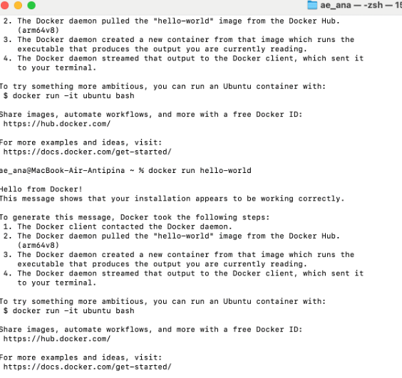  

2. **Скачала образ Ubuntu:**  
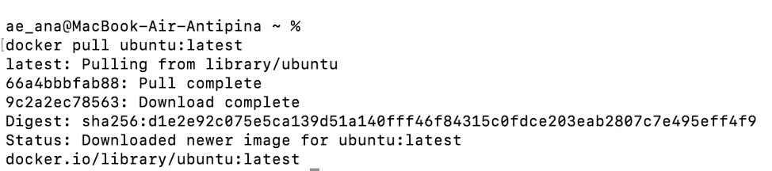  
   - Запущен интерактивный контейнер:  
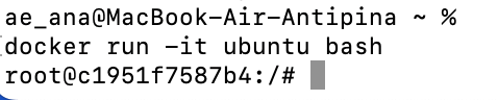  
   - Внутри контейнера установлен `curl`.  
   - Проверено наличие `curl`.  
   - Выход из контейнера (`exit`):  
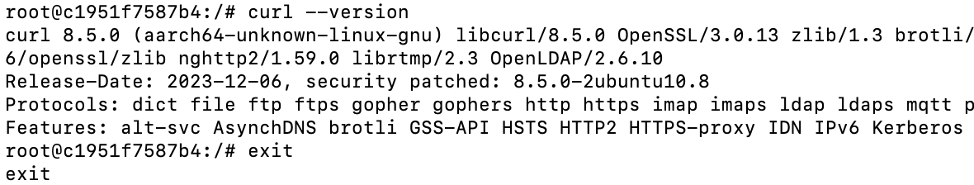

3. **Запустила контейнер с nginx (так как образа не было, он скачался). Работает на локальном хосте, всё корректно:**  
   - Выполнена команда: `docker run -d -p 80:80 nginx`.  
   - Проверено, что сервер доступен: `curl http://localhost`.  
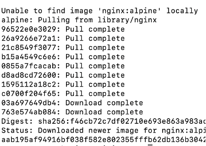  
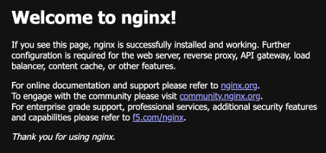  
   - Просмотрены логи контейнера  
   - Выполнено одключение к контейнеру:
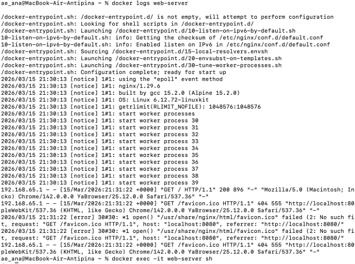  

4. **Посмотрела запущенные контейнеры и все контейнеры. Остановила контейнер, далее запустила остановленный контейнер и снова остановила для его дальнейшего удаления. Удалила образ:**  
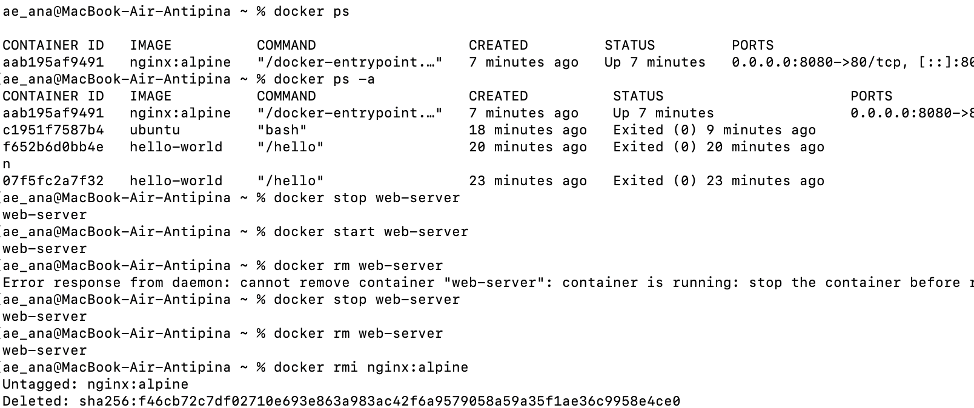  

5. **Создала том, запустила контейнер с томом, подключилась к контейнеру, создала файл в томе: Удалила контейнер и создала новый с тем же томом. В контейнере запустила команду cat для проверки содержимого файла:**
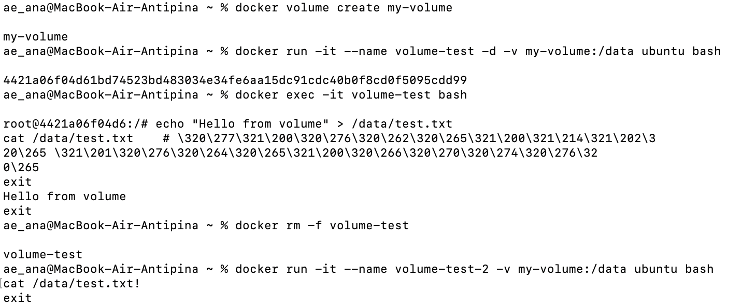  

# Лабораторная работа со звездочкой  

**Создала Dockerfile на основе образа python. В нём задала рабочую директорию, установлен пакет curl, скопированы файлы app.py и requirements.txt, установлены Python‑зависимости, открыт порт 5000, приложение запускается командой python app.py. Образ собран командой docker build -t my-flask-app, контейнер запущен, а его работа проверена запросом curl http://localhost:6000 — получен ответ «Hello from Docker!».**  
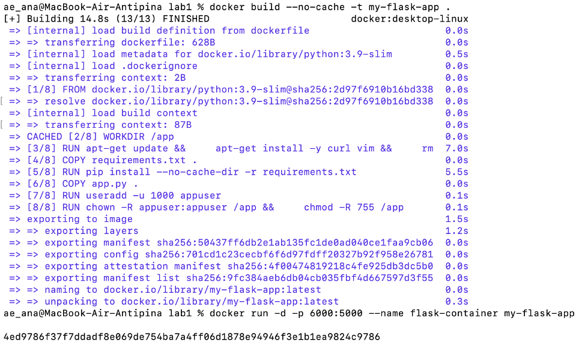  
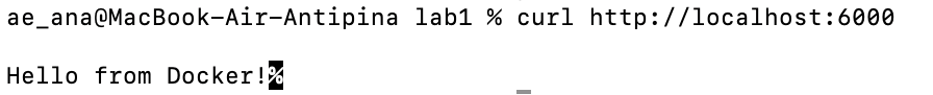  
