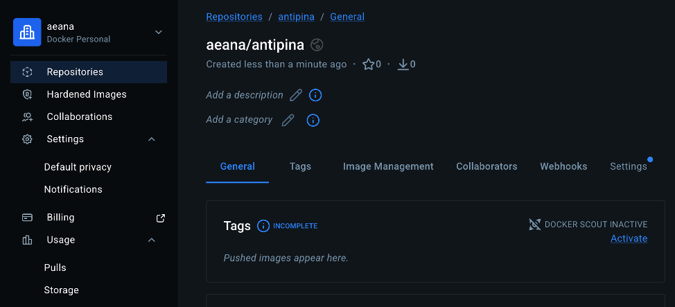
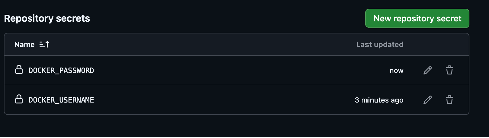
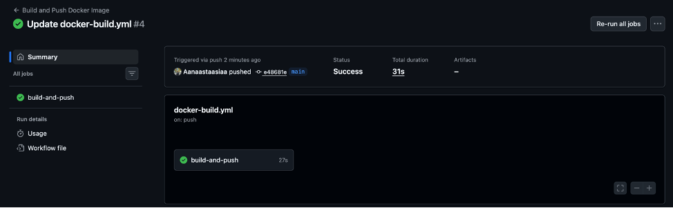
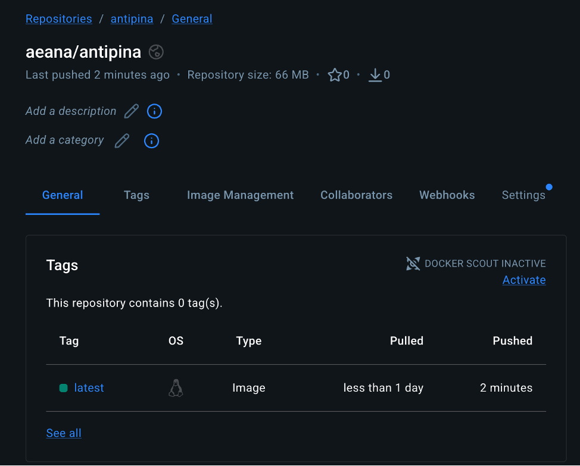
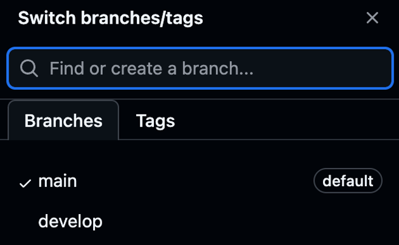
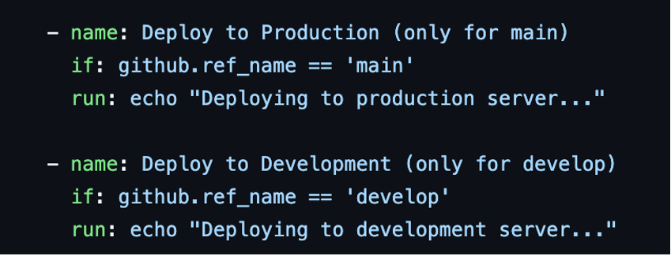
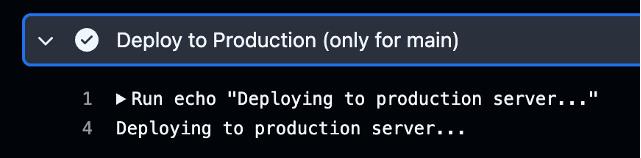
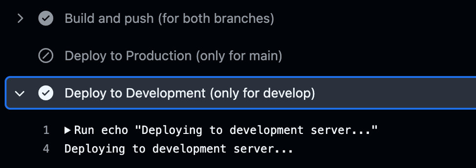

# Лабораторная работа № 2

**Университет:** [ITMO University](https://itmo.ru/ru/)  
**Факультет:** [FTMI] 
**Курс:** [Введение в веб‑технологии](https://itmo-ict-faculty.github.io/introduction-in-web-tech/)  
**Группа:** U4125  
**Автор:** Антипина Анастасия Евгеньевна  
**Лабораторная работа:** Lab2 
**Дата создания:** 16.03.2026  
**Дата сдачи:** 16.03.2026

---

## Выполненные задания

1. *Создан репозиторий на Docker Hub.:**  
   - В корень репозитория GitHub скопированы файлы из предыдущей лабораторной.  
   - Зарегистрирован аккаунт на Docker Hub.  
  

2. **Настройка GitHub Actions:**  
   - В корне репозитория создана папка .github/workflows/.  
   - Создан файл .github/workflows/docker-build.yml со следующим содержанием:  
   [Пайплайн GitHub Actions](./.github/workflows/docker-build.yml)  

3. **Настройка секретов**  
   В разделе Secrets and variables → Actions добавила два секрета:  
   - DOCKER_USERNAME — логин от Docker Hub;  
   - DOCKER_PASSWORD — персональный токен доступа.  
  

4. **Тестирование пайплайна**  
    - Был создан и сохранен коммит в ветку main посредством изменения в README.md.  
    - В разделе Actions появился запуск пайплайна. Все шаги выполнены успешно (зелёные галочки ✅).  
  
    - Образ появился в Docker Hub:  
  
    - В логах видно сообщение: Deploying to production server...  

# Лабораторная работа со звездочкой  
1. **Создание ветки develop**  
    - Через выпадающий список веток выбран пункт New branch.  
    - Указано имя ветки develop и нажата кнопка Create branch:  
  

2. **Настройка пайплайна для двух веток**  
    - В файле .github/workflows/docker-build.yml обновлена секция on и добавлена новая ветка.  
    - В секцию jobs добавлены два шага с условиями:  
  

3. **Тестирование**  
    - Был создан коммит в ветку develop: посредством переключения на данную ветку было внесено и сохранено изменение в README.md.  
    - В разделе Actions открыт запуск пайплайна и в логах найден шаг Deploy to Development с сообщением:  
  

    - По аналогии был создан коммит в ветку main.
    - В разделе Actions открыт запуск пайплайна и в логах найден шаг Deploy to Production с сообщением:
  

