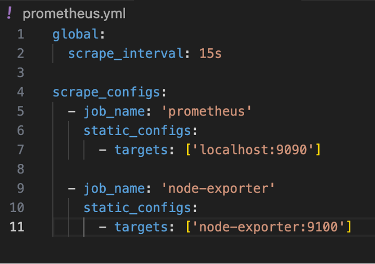
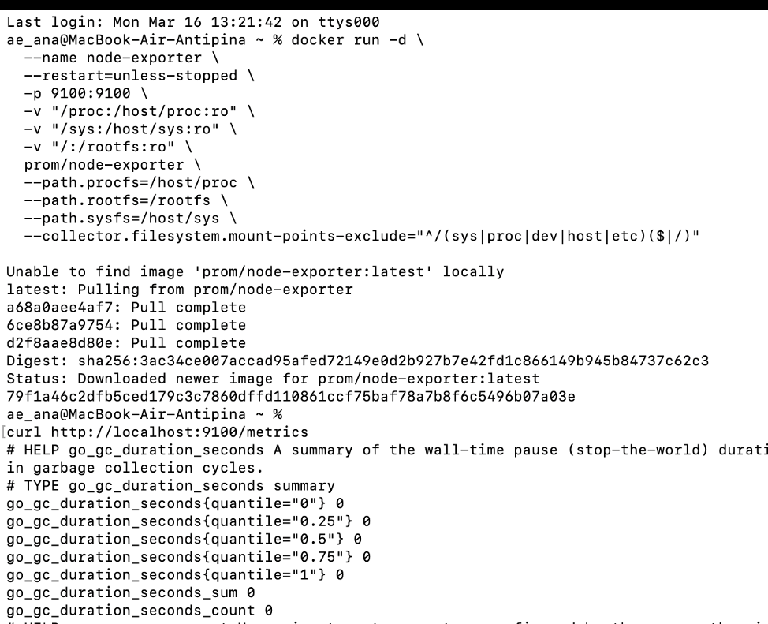
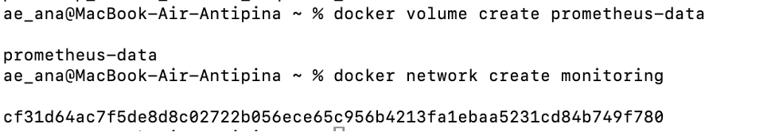
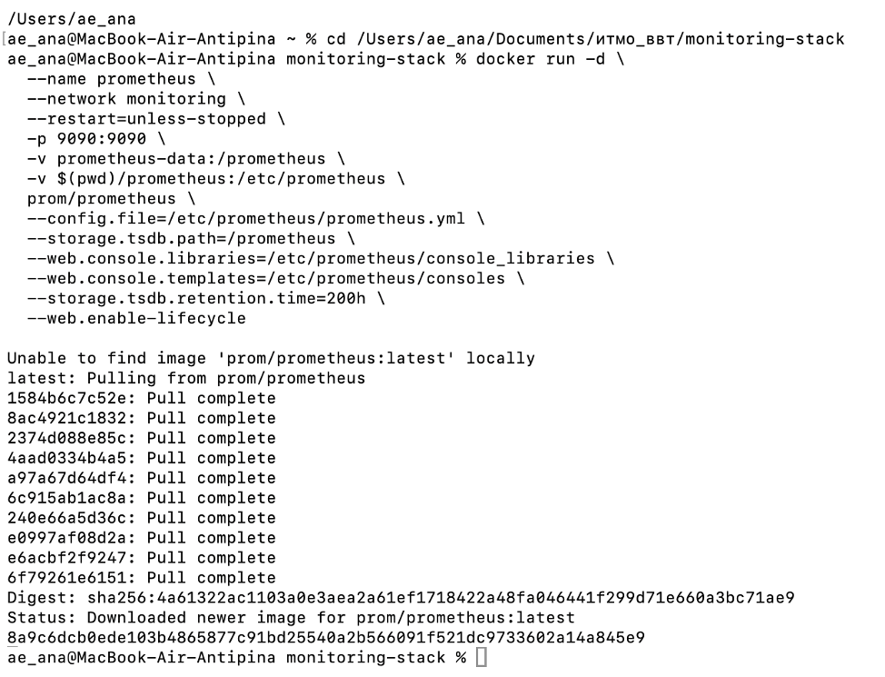
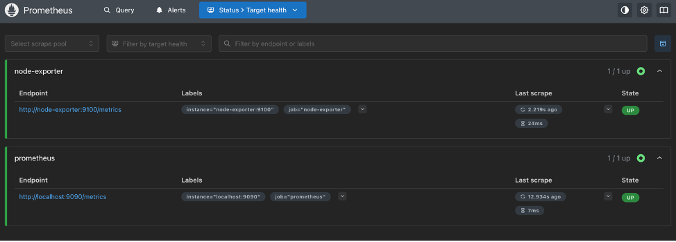
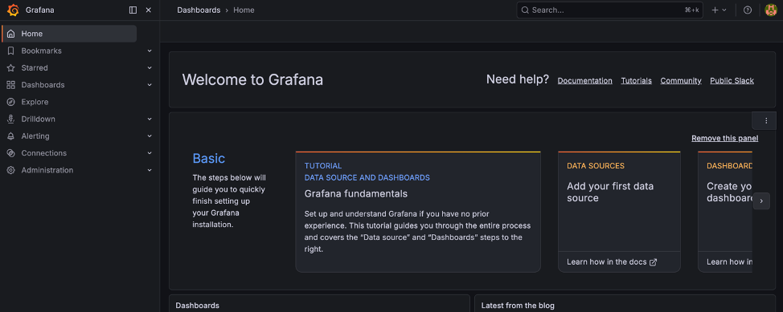
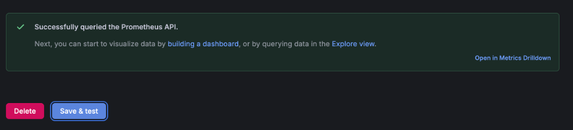
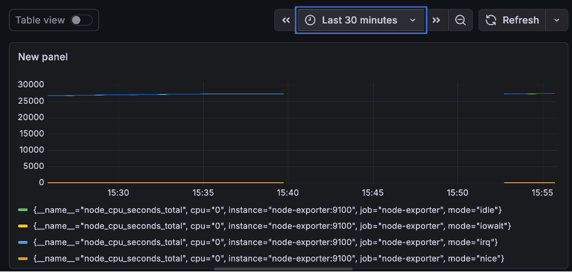
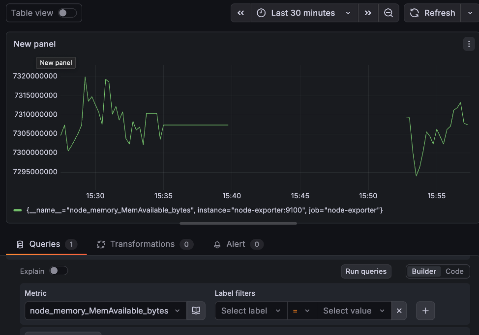

# Лабораторная работа № 3

**Университет:** [ITMO University](https://itmo.ru/ru/)  
**Факультет:** [FTMI] 
**Курс:** [Введение в веб‑технологии](https://itmo-ict-faculty.github.io/introduction-in-web-tech/)  
**Группа:** U4125  
**Автор:** Антипина Анастасия Евгеньевна  
**Лабораторная работа:** Lab3 
**Дата создания:** 16.03.2026  
**Дата сдачи:** 17.03.2026

---

## Выполненные задания

1. *Подготовка конфигурации Prometheus:**  
   - Создана папка prometheus для конфигурации.  
   - В папке создан файл prometheus.yml:  
  

2. **Запуск Node Exporter:**  
   - Выполнена команда для запуска контейнера.  
   - Проверка работы: curl http://localhost:9100/metrics.  
   - Получен ответ с метриками — Node Exporter работает.  
  

3. **Запуск Prometheus и проверка работы**  
   - Создан том для данных и сеть для взаимодействия контейнеров:  
  
   - Запущен контейнер Prometheus:  
  
   - Проверка работы: открыт http://localhost:9090 в браузере → интерфейс Prometheus доступен.  
   - В разделе Status → Targets оба источника (prometheus, node-exporter) имеют статус UP:  
  

4. **Запуск Grafana**  
    - Создан том для данных Grafana.  
    - Запущен контейнер Grafana.  
    - Проверка работы: открыт http://localhost:3000 в браузере.  
    - Вход с логином admin и паролем admin → интерфейс Grafana доступен:  
  

5. **Настройка Grafana**  
    - Добавленлен источник данных Prometheus и указан его URL: http://prometheus:9090.  
    - Нажата кнопка Save & Test → получено зелёное сообщение Data source is working.  
  
    - Был создан дашборд с источником данных Prometheus.  
    - В поле Query введены метрики: node_cpu_seconds_total, node_memory_MemAvailable_bytes, node_filesystem_avail.  
    - Дашборд сохранён:  

  

6. **Тестирование**  
    - Проверка контейнеров:  
      Все контейнеры (node-exporter, prometheus, grafana) работают.  
    - Проверка метрик в Prometheus:  
      Открыт http://localhost:9090/targets → статус UP для всех целей.  
    - Проверка графиков в Grafana:  
      Открыт дашборд → графики отображают данные.  
      Проверены все панели (CPU, память, диск) → данные актуальны.  
